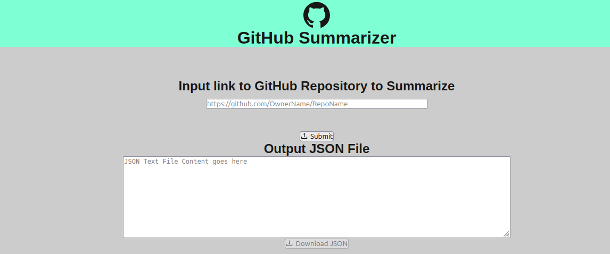
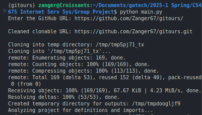

# gitours

_This project was created by a group (Group 14) of Georgia Tech students for CS4675/6675._

Gitours is a project designed to assist with smaller opensource projects by helping create codetour tours of a project, summarizing its overall structure and helping guide new potential maintainers to understanding how a project is designed, smoothing the onboarding process.

Codetours is an opensource VS Code extension maintained by Microsoft that allows the creation of in essence a guided tour / powerpoint which jumps from code segment to code segment, file to file, whilst also providing markdown summaries and notes.

-   [VS Code Store URL](https://marketplace.visualstudio.com/items?itemName=vsls-contrib.codetour)
-   [GitHub Repo URL](https://github.com/microsoft/codetour)

## Setup

We recommend creating a conda environment for this due to the package requirements.

### Frontend npm setup

```bash
# npm is not installed
sudo apt install npm

# npm packages are not installed
# enter the 'githubsummarizer/' directory and run...
npm install
```

### Python package requirements

From the project root folder, please run...

```bash
pip install -r requirements.txt
```

### API keys

This project requires an OpenAI API key to be provided. Please create a `.env` file in the root directory with the following contents:

```env
OPENAI_API_KEY=YOUR_API_KEY_HERE
```

## Running gitours

### gitours via the LocalHost Interface

In order for the application function correctly, both the front-end React.js app and the
back-end Python Flask app need to be running at the same time. To launch the Flask back-end,
navigate to the `backend` directory and input the command `python backend.py` into your
terminal. `backend.py` needs to continue running in a terminal, so you will need to use
a 2nd simultaneous terminal instance to launch and support the front-end.

```bash
cd backend
python backend.py
```

For the frontend, open a new terminal instance, navigate to the `frontend/` directory and run...

```bash
cd frontend
```

```bash
npm run dev
# or
yarn dev
# or
pnpm dev
# or
bun dev
```

Open [http://localhost:3000](http://localhost:3000) with your browser to see the result.



### gitours via CLI

To run just the gitours python locally without a frontend interface, run `main.py` in the root directory.

```bash
python main.py
```

You will be prompted for a github repo url. The output will be saved to `temp_output_codetour.tour` in the root directory.



## Important App Files

-   `programs/` : the bulk of our actual product is found here including all data parsing, organization, and api calling. Files to note from most to least important include...
    -   `itemizer.py` takes our repo data and maps all relationships between variables, method calls, etc. giving our LLM context as to where various characters are defined and used.
    -   `clone_summary.py` is where our API calls and prompt designs are located. After the repo is cloned and organized, we pass all information into the functions located here.
    -   `repo_data.py` hosts the `gitRepo` class which takes a GitHub repo url, clones it into a temporary directory, and allows its reuse for various points of our program. It acts to ensure file cleanup if any issues arise or the program completes.
    -   `codetours.py` takes the responses from `clone_summary.py` and attempts to convert them into a viable `.tour` codetour file.
    -   `helpers.py` includes various assisting methods such as url cleaners and validators
-   `backend/` :
    -   `backend.py` contains a simple flask api to allow our frontend to run our primary program.
-   `frontend/` : the JavaScript and CSS files that make up the app's pages can be found in the `src/app` folder. Files to note include...
    -   `page.js` contains the JavaScript code that makes up the app's one and only (as of now) page.
    -   `exampleText.js` contains constants and methods that are intended to be used for testing, and may be removed later.
    -   `globals.css` contains the CSS code for the app's one and only (as of now) page.

### Versions

-   Version 0.1: Created skeleton for app front-end. The app has a basic UI consisting of a textfield for the user to input a link to a GitHub repository, and a textarea where the contents of a JSON file will appear. There is also a button below the textarea to download the textarea's current contents as a JSON file to the user's device. The textfield currently only checks if the input string starts with `https://` when the user clicks on the submit button. If so, then a success message will appear, and the textarea will be populated with example data. This example data will always be the same regardless of the link that was input by the user.
-   Version 0.2: Back-end functionality has been added, and can be linked to the front-end app.
